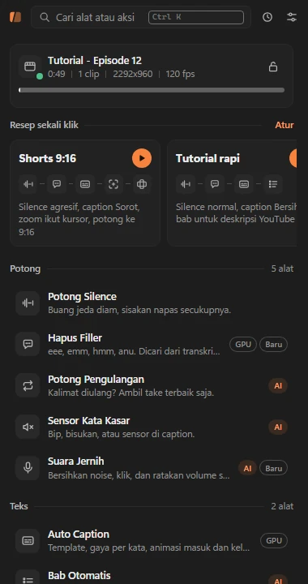
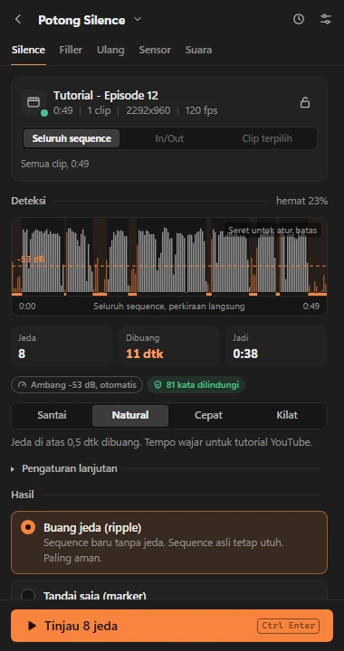
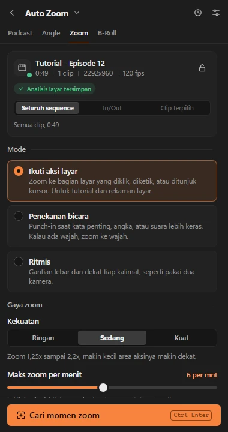

<p align="center">
  
</p>

<h1 align="center">Klipora</h1>

<p align="center">
  <strong>Bagian membosankan dari edit video, biar Premiere Pro yang urus.</strong><br>
  Panel gratis dan open-source untuk Adobe Premiere Pro: potong jeda dan filler, bikin caption animasi,
  tambah zoom dan bab, sampai merapikan suara. Semuanya jalan di PC kamu sendiri.
</p>

<p align="center">
  <a href="https://klipora.vercel.app/id">Website</a> ·
  <a href="https://klipora.vercel.app/id/docs">Dokumentasi</a> ·
  <a href="README.md">English</a> ·
  <a href="https://github.com/muhrifqie/klipora/issues">Lapor bug</a>
</p>

<p align="center">
  
  
  
</p>

---

## Apa itu Klipora

Klipora terdiri dari dua bagian:

- **Panel** (`panel/`): ekstensi CEP yang menempel di dalam Premiere Pro. Semua alat alurnya sama: pilih preset,
  **tinjau** hasilnya sebagai daftar centang (klik baris untuk memindah playhead ke sana), lalu **terapkan**.
  Hasil edit masuk ke salinan sequence, jadi sequence aslimu tidak pernah diubah.
- **Engine** (`engine/`): program Python lokal yang mengerjakan proses berat: transkripsi dengan faster-whisper,
  analisis audio, render caption dengan libass, serta deteksi wajah dan aktivitas layar.

Tampilan tersedia dalam **Bahasa Indonesia dan English** (mengikuti bahasa Premiere, atau pilih di Pengaturan).
Transkripsi dan aturannya disetel untuk ucapan Bahasa Indonesia dan Inggris.

## Fitur

**Potong**
- **Potong Silence**: membuang jeda di semua track audio yang tidak di-mute. Ada empat preset, garis ambang yang
  bisa digeser di gelombang audio, dan pelindung kata supaya ucapan tidak terpotong.
- **Hapus Filler**: eh, em, hmm, dan kata kebiasaan, dicari dari transkrip, dengar ulang verbatim, dan detektor
  akustik.
- **Potong Pengulangan**: gagap, mulai ulang, dan take ulang; take terakhir yang disimpan.
- **Sensor Kata Kasar**: bip, bisukan, atau kecilkan kata kasar, plus sensor di caption. Daftar blokir dan izin
  bisa diatur sendiri.
- **Suara Jernih**: hapus noise (DeepFilterNet atau RNNoise), klik dan napas, tiru EQ dari klip contoh, target
  volume per platform, dan ducking musik.

**Teks**
- **Auto Caption**: 50+ template, sorot per kata, animasi, emoji, Brand Kit, kamus untuk nama yang sering salah
  dengar, dan posisi otomatis yang menghindari wajah. Hasilnya bisa overlay, MOGRT, atau track caption asli (SRT).
- **Bab Otomatis**: marker bab plus timestamp YouTube, judul, deskripsi, dan tag.

**Kamera**
- **Auto Zoom**: zoom halus yang mengikuti kursor atau menekankan momen penting saat bicara.
- **Angle Otomatis**: variasi crop dari satu kamera supaya tidak monoton.
- **Podcast Multicam**: kamera pindah ke orang yang sedang bicara (satu mic per orang).
- **B-Roll**: menyarankan dan menaruh klip dari folder sendiri, Pexels (dengan kunci kamu), atau endpoint gambar AI.

**Publikasi**
- **Auto Resize**: 9:16, 1:1, 4:5 dengan reframe otomatis yang mengikuti pembicara atau aksi di layar.
- **Klip Viral**: memberi skor momen terbaik untuk Shorts dan membuat sub-sequence untuk tiap momen.

Ada juga resep sekali klik, palet perintah (<kbd>Ctrl</kbd>+<kbd>K</kbd>), riwayat, dan lapisan AI opsional
yang tidak pernah wajib: setiap fitur AI punya cadangan berbasis aturan.

## Kebutuhan

| Bagian | Yang dibutuhkan |
|---|---|
| OS | Windows 10 atau 11, 64-bit (dites di Windows 11). macOS belum didukung. |
| Premiere Pro | 2026 (26.x). Panel ini ekstensi CEP (CSXS 12). |
| Python | 3.12 atau lebih baru (dites dengan 3.14), dengan pip. |
| FFmpeg | Full build di `PATH` (libass untuk caption; NVENC opsional), misalnya `winget install Gyan.FFmpeg`. |
| GPU | Opsional. GPU NVIDIA dengan driver baru menjalankan Whisper di CUDA 12 (dites dengan VRAM 8 GB). Tanpa GPU, CPU yang dipakai. |
| Disk | Beberapa GB kosong untuk model Whisper, cache, dan render. |

## Cara pasang

Buka PowerShell. Contoh di sini memakai `C:\klipora`.

```powershell
# 1. Ambil kodenya
git clone https://github.com/muhrifqie/klipora.git C:\klipora
cd C:\klipora

# 2. Paket Python (requirements-gpu.txt hanya kalau punya GPU NVIDIA)
py -m pip install --no-cache-dir -r requirements.txt
py -m pip install --no-cache-dir -r requirements-gpu.txt

# 3. FFmpeg (buka terminal baru setelahnya supaya PATH ter-update)
winget install Gyan.FFmpeg
```

### Aktifkan panel di Premiere

Klipora tidak ditandatangani dan tidak lewat Adobe Exchange, jadi Premiere baru memuatnya setelah ekstensi CEP
tanpa tanda tangan diizinkan. Premiere Pro 26.x memakai CEP 12, yang membaca kunci `CSXS.12`.

```powershell
# Izinkan panel CEP tanpa tanda tangan untuk user Windows kamu (tanpa admin; ubah ke 0 untuk membatalkan)
reg add "HKCU\Software\Adobe\CSXS.12" /v PlayerDebugMode /t REG_SZ /d 1 /f

# Hubungkan folder panel ke folder ekstensi CEP (junction: `git pull` ikut meng-update panel)
New-Item -ItemType Directory -Force "$env:APPDATA\Adobe\CEP\extensions" | Out-Null
New-Item -ItemType Junction -Path "$env:APPDATA\Adobe\CEP\extensions\com.klipora.panel" -Target "C:\klipora\panel"
```

Atau jalankan skrip bantuan. Skrip ini mengecek Python dan FFmpeg, menampilkan setiap perubahan, dan bertanya
dulu sebelum mengubah apa pun:

```powershell
powershell -ExecutionPolicy Bypass -File .\scripts\install.ps1
```

Buka ulang Premiere Pro, lalu pilih **Window > Extensions > Klipora**. Panel tetap rapi mulai lebar 280 px.

### Pemakaian pertama

1. Buka **Pengaturan** (ikon slider). Di bagian **Mesin**, isi **Python** dengan `py`, `python`, atau path lengkap
   `python.exe`, lalu klik tombol tesnya.
2. Klik **Cek ulang**: Python, FFmpeg, dan GPU harus hijau. Titik AI tetap abu-abu sampai kamu menambah
   penyedia, dan itu normal.
3. Pilih **Folder kerja** di drive yang masih lega (bawaan `%USERPROFILE%\Videos\Klipora`). File tinjauan, render,
   dan XML disimpan di sana, satu folder per sequence.
4. Buka sebuah sequence dan mulai dari **Potong Silence**. Transkripsi pertama mengunduh model Whisper
   (`large-v3-turbo`), jadi sekali itu lebih lama.

## Penyedia AI (opsional)

Klipora tidak butuh AI untuk bekerja. Kalau kamu menambah penyedia di **Pengaturan > AI**, beberapa alat memberi
saran yang lebih pintar (judul bab, peringkat klip viral, merapikan teks caption, rencana B-roll, sorot kata
penting). Hasilnya selalu ditinjau dulu dan disimpan di cache, dan setiap tugas kembali ke aturan bawaan kalau
penyedianya tidak bisa dihubungi.

Preset bawaan: OpenRouter, Gemini, OpenAI, xAI, Anthropic, DeepSeek, Groq, Ollama (lokal), preset
**Proxy lokal (kompatibel OpenAI)** (bawaan `http://127.0.0.1:8168/v1`, untuk endpoint kompatibel OpenAI yang kamu
jalankan sendiri), dan endpoint custom. Beberapa penyedia bisa diurutkan sebagai cadangan. Lihat
[docs/AI_PROVIDERS.md](docs/AI_PROVIDERS.md).

## Privasi

- Video, audio, dan transkrip diproses **di PC kamu**. Tidak ada yang diunggah kecuali kamu menyalakan penyedia
  AI, dan itu pun hanya teks transkrip (dan untuk beberapa fitur visual, satu-dua frame) yang dikirim ke penyedia
  pilihanmu.
- Kunci API dienkripsi dengan Windows DPAPI untuk user Windows kamu, dan tidak pernah tampil di panel, log, atau
  file yang bisa dibaca panel. Lihat [SECURITY.md](SECURITY.md).
- Tanpa telemetri, tanpa akun, tanpa cek update. Koneksi lain hanya unduhan model Whisper sekali di awal
  (Hugging Face, lewat faster-whisper) dan pencarian Pexels kalau kamu mengisi kunci Pexels untuk B-Roll.

## Pengujian

```powershell
# Tes engine (offline, tanpa GPU, tanpa kuota AI). Tes yang butuh video asli dilewati dengan rapi.
python engine/tests/run_all.py

# Tes panel di Chrome headless dengan Premiere palsu (CEP stub)
node tools/ui_test.mjs tools/ui_tests/smoke.mjs
node tools/ui_test.mjs tools/ui_tests/viral.mjs --seq long35
node tools/i18n_check.mjs      # semua teks UI ada di kedua bahasa
node tools/compat_check.mjs    # batasan runtime CEP 12 (Chrome 99) dan kode host ES3
```

Tes dengan video asli membaca `KLIPORA_TEST_MEDIA`, yaitu folder berisi `talk_49s.mp4` (klip bicara/tutorial
~49 dtk), `talk_35m.mp4` (~35 mnt), dan `seq_2m.mp4` (~2 mnt), atau `media.json` di folder itu yang memetakan
nama tadi ke file di tempat lain. Tanpa variabel itu, tesnya dilewati, dan beberapa tes inti memakai klip sintetis
kecil buatan FFmpeg. Detailnya di [CONTRIBUTING.md](CONTRIBUTING.md).

## Struktur proyek

```
panel/            ekstensi CEP: index.html, js/ (core, pages, tools), css/, host/*.jsx (ExtendScript), locales/
engine/           engine Python: cli.py, worker.py, ac/ (media, timeline, transcript, captions, ai, tools/), tests/
engine/ac/assets  model bawaan (DeepFilterNet, RNNoise, YuNet) dan efek suara caption
tools/            harness tes UI headless (ui_test.mjs + cep_stub.js), cek i18n dan kompatibilitas
scripts/          skrip bantuan instalasi
website/          situs statis (klipora.vercel.app), dibuat oleh website/_tools/build.mjs
docs/             spesifikasi, API engine/panel, satu halaman per alat (mulai dari docs/README.md)
```

## Rencana

- ZXP bertanda tangan / installer, supaya PlayerDebugMode tidak perlu lagi
- Dukungan macOS
- Versi UXP kalau API UXP Premiere sudah mencakup fitur timeline yang dibutuhkan
- Template caption dan bahasa tambahan

Ide dan laporan bug silakan lewat [issues](https://github.com/muhrifqie/klipora/issues).

## Lisensi

[MIT](LICENSE). Font bawaan memakai SIL Open Font License (`engine/ac/captions/fonts/LICENSES`), model
DeepFilterNet3 memakai MIT, dan model wajah YuNet memakai lisensi MIT (lihat README di samping modelnya).

## Catatan

Klipora adalah proyek independen dan **tidak berafiliasi dengan, didukung, atau disponsori oleh Adobe**. Adobe dan
Premiere Pro adalah merek dagang Adobe Inc. Merek lain milik pemiliknya masing-masing.
