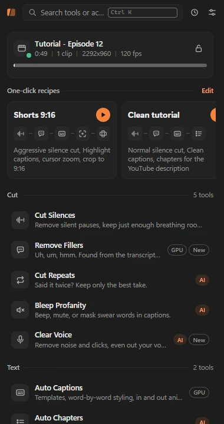
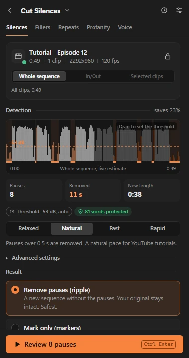
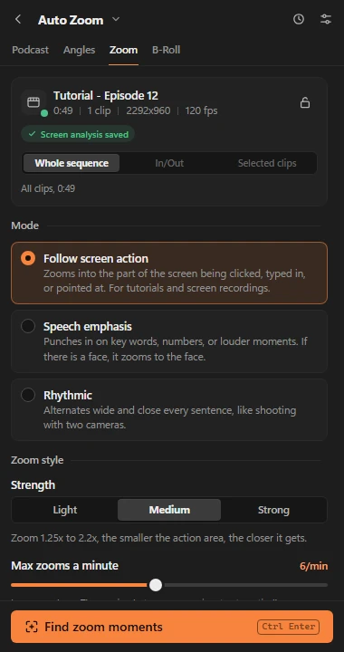

<p align="center">
  
</p>

<h1 align="center">Klipora</h1>

<p align="center">
  <strong>Edit the boring parts out of Premiere Pro.</strong><br>
  A free, open-source panel for Adobe Premiere Pro that cuts silences and fillers, writes animated captions,
  adds zooms and chapters, and cleans up your voice. It runs on your own PC.
</p>

<p align="center">
  <a href="https://klipora.vercel.app">Website</a> ·
  <a href="https://klipora.vercel.app/docs">Docs</a> ·
  <a href="README.id.md">Bahasa Indonesia</a> ·
  <a href="https://github.com/muhrifqie/klipora/issues">Report a bug</a>
</p>

<p align="center">
  
  
  
</p>

---

## What it is

Klipora has two parts:

- **The panel** (`panel/`): a CEP extension that docks inside Premiere Pro. Every tool follows the same flow:
  pick a preset, **review** the result as a checklist (click a row to jump the playhead there), then **apply**.
  Edits land on a cloned sequence, so your original is never touched.
- **The engine** (`engine/`): a local Python program that does the heavy work: transcription with
  faster-whisper, audio analysis, caption rendering with libass, face and screen-activity detection.

The UI is available in **English and Indonesian** (it follows Premiere's language, or pick one in Settings).
Transcription and most rules are tuned for Indonesian and English speech.

## Features

**Cut**
- **Cut Silences**: removes pauses across all unmuted audio tracks with four presets, a draggable threshold on
  the waveform, and a word guard so speech is never clipped.
- **Remove Fillers**: uh, um, hmm and habit words, found from the transcript, a second verbatim listening pass
  and an acoustic detector.
- **Cut Repeats**: stutters, restarts and retakes; keeps your last take.
- **Bleep Profanity**: beep, mute or duck swear words, and mask them in captions. Custom block and allow lists.
- **Clear Voice**: noise reduction (DeepFilterNet or RNNoise), click and breath control, EQ match from a
  reference clip, loudness target per platform, music ducking.

**Text**
- **Auto Captions**: 50+ templates, word-by-word highlight, animations, emoji, brand kits, a glossary for names
  that are often misheard, smart positioning that avoids faces. Output as burned-in overlay, MOGRT or native
  caption track (SRT).
- **Auto Chapters**: chapter markers plus YouTube timestamps, titles, description and tags.

**Camera**
- **Auto Zoom**: smooth zooms that follow the cursor or emphasise key moments in speech.
- **Auto Angles**: punch-in crops from a single camera for variety.
- **Podcast Multicam**: switches to whoever is talking (one mic per speaker).
- **B-Roll**: suggests and places clips from your own library, Pexels (with your key) or an AI image endpoint.

**Publish**
- **Auto Resize**: 9:16, 1:1, 4:5 with automatic reframing that tracks the speaker or the screen action.
- **Viral Clips**: scores the best moments for Shorts and builds a sub-sequence for each.

Also: one-click recipes, a command palette (<kbd>Ctrl</kbd>+<kbd>K</kbd>), history, and an optional AI layer
that is never required: every AI feature has a rule-based fallback.

## Requirements

| Part | Needed |
|---|---|
| OS | Windows 10 or 11, 64-bit (tested on Windows 11). macOS is not supported yet. |
| Premiere Pro | 2026 (26.x). The panel is a CEP extension (CSXS 12). |
| Python | 3.12 or newer (tested with 3.14), with pip. |
| FFmpeg | A full build on `PATH` (libass for captions; NVENC optional), e.g. `winget install Gyan.FFmpeg`. |
| GPU | Optional. An NVIDIA GPU with a recent driver runs Whisper on CUDA 12 (tested with 8 GB VRAM). Without it the CPU is used. |
| Disk | A few GB free for the Whisper model, caches and renders. |

## Install

Open PowerShell. The examples use `C:\klipora`.

```powershell
# 1. Get the code
git clone https://github.com/muhrifqie/klipora.git C:\klipora
cd C:\klipora

# 2. Python packages (add requirements-gpu.txt only if you have an NVIDIA GPU)
py -m pip install --no-cache-dir -r requirements.txt
py -m pip install --no-cache-dir -r requirements-gpu.txt

# 3. FFmpeg (open a new terminal afterwards so PATH is updated)
winget install Gyan.FFmpeg
```

### Enable the panel in Premiere

Klipora is not signed or distributed through Adobe Exchange, so Premiere only loads it after you allow unsigned
CEP extensions. Premiere Pro 26.x uses CEP 12, which reads the `CSXS.12` key.

```powershell
# Allow unsigned CEP panels for your Windows user (no admin needed; set it back to 0 to undo)
reg add "HKCU\Software\Adobe\CSXS.12" /v PlayerDebugMode /t REG_SZ /d 1 /f

# Link the panel folder into the CEP extensions folder (a junction: `git pull` updates the panel too)
New-Item -ItemType Directory -Force "$env:APPDATA\Adobe\CEP\extensions" | Out-Null
New-Item -ItemType Junction -Path "$env:APPDATA\Adobe\CEP\extensions\com.klipora.panel" -Target "C:\klipora\panel"
```

Or run the helper, which checks Python and FFmpeg, prints every change and asks before making it:

```powershell
powershell -ExecutionPolicy Bypass -File .\scripts\install.ps1
```

Restart Premiere Pro, then open **Window > Extensions > Klipora**. The panel works from 280 px wide.

### First run

1. Open **Settings** (slider icon). Under **Engine**, set **Python** to `py`, `python` or the full path to
   `python.exe`, then click **Test connection**.
2. Click **Check again**: Python, FFmpeg and GPU should turn green. The AI dot stays grey until you add a
   provider, which is fine.
3. Pick a **work folder** on a drive with free space (default `%USERPROFILE%\Videos\Klipora`). Reviews, renders and
   XML files go there, one folder per sequence.
4. Open a sequence and start with **Cut Silences**. The first transcription downloads the Whisper model
   (`large-v3-turbo`), so it takes longer once.

## AI providers (optional)

Nothing in Klipora needs AI. When you add a provider in **Settings > AI**, some tools get smarter suggestions
(chapter titles, viral clip ranking, caption cleanup, B-roll planning, key-word emphasis). Results are always
shown for review and cached, and every task falls back to rules when the provider is down.

Built-in presets: OpenRouter, Gemini, OpenAI, xAI, Anthropic, DeepSeek, Groq, Ollama (local), a
**Local proxy (OpenAI-compatible)** preset (default `http://127.0.0.1:8168/v1`, for any OpenAI-compatible endpoint
you run yourself) and a custom endpoint. You can order several providers as fallbacks. See
[docs/AI_PROVIDERS.md](docs/AI_PROVIDERS.md).

## Privacy

- Video, audio and transcripts are processed **on your PC**. Nothing is uploaded unless you turn on an AI
  provider, and then only transcript text (and, for a few vision features, single frames) goes to the provider
  you chose.
- API keys are encrypted with Windows DPAPI for your Windows user and are never shown in the panel, logs or
  files the panel can read. See [SECURITY.md](SECURITY.md).
- No telemetry, no account, no update pings. The only other network calls are the one-time Whisper model download
  (Hugging Face, via faster-whisper) and Pexels searches if you add a Pexels key for B-Roll.

## Testing

```powershell
# Engine tests (offline, no GPU, no AI quota). Tests that need real footage skip cleanly.
python engine/tests/run_all.py

# Panel tests in headless Chrome with a fake Premiere (CEP stub)
node tools/ui_test.mjs tools/ui_tests/smoke.mjs
node tools/ui_test.mjs tools/ui_tests/viral.mjs --seq long35
node tools/i18n_check.mjs      # every UI string in both languages
node tools/compat_check.mjs    # CEP 12 runtime (Chrome 99) and ES3 host code limits
```

Real-footage tests read `KLIPORA_TEST_MEDIA`, a folder with `talk_49s.mp4` (~49 s talking/tutorial clip),
`talk_35m.mp4` (~35 min) and `seq_2m.mp4` (~2 min), or a `media.json` there that maps those names to files
elsewhere. Without it they skip, and a few core tests use a small synthetic clip generated with FFmpeg instead.
Details in [CONTRIBUTING.md](CONTRIBUTING.md).

## Project structure

```
panel/            CEP extension: index.html, js/ (core, pages, tools), css/, host/*.jsx (ExtendScript), locales/
engine/           Python engine: cli.py, worker.py, ac/ (media, timeline, transcript, captions, ai, tools/), tests/
engine/ac/assets  bundled models (DeepFilterNet, RNNoise, YuNet) and caption sound effects
tools/            headless UI test harness (ui_test.mjs + cep_stub.js), i18n and compatibility checks
scripts/          install helper
website/          static site (klipora.vercel.app), generated by website/_tools/build.mjs
docs/             specs and engine/panel APIs, one page per tool (start at docs/README.md)
```

## Roadmap

- Signed ZXP / installer, so PlayerDebugMode is no longer needed
- macOS support
- UXP version of the panel when Premiere's UXP API covers the timeline features Klipora needs
- More caption templates and languages

Ideas and bug reports are welcome in [issues](https://github.com/muhrifqie/klipora/issues).

## License

[MIT](LICENSE). Bundled fonts are under the SIL Open Font License
(`engine/ac/captions/fonts/LICENSES`), DeepFilterNet3 models under MIT (`engine/ac/assets/models/deepfilternet3/LICENSE-MIT`), and the YuNet face model under
the MIT licence (see the README files next to the models).

## Disclaimer

Klipora is an independent project and is **not affiliated with, endorsed by or sponsored by Adobe**. Adobe and
Premiere Pro are trademarks of Adobe Inc. All other trademarks belong to their owners.
